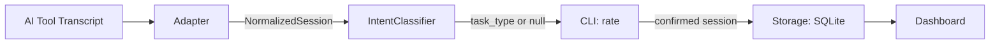
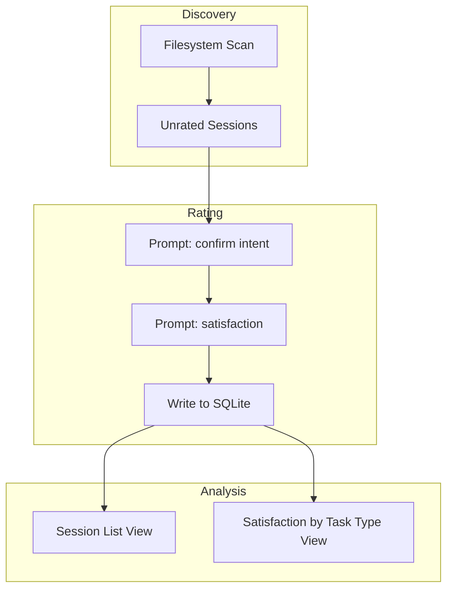
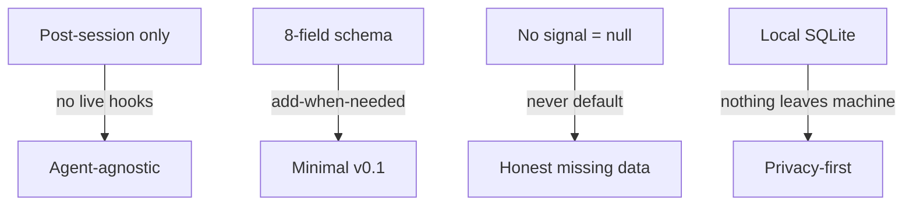

# Shepherd Architecture

## Data Flow

## Schemas

### NormalizedSession

The single contract between adapters and the rest of the system. Every adapter must produce this shape.

| Field | Type | Description |
|-------|------|-------------|
| `session_id` | `str` | Unique session identifier |
| `timestamp_start` | `str \| None` | ISO 8601 start time |
| `end_type` | `str \| None` | `confirmed` / `closed` / `timed_out` / `clear` |
| `task_type` | `str \| None` | Inferred: `feature` / `bugfix` / `refactor` / `exploration` / `review` / `docs` |
| `intent_confirmed` | `bool` | User confirmed the inferred task_type |
| `satisfaction` | `str \| None` | `satisfied` / `partial` / `unsatisfied` |
| `skills_used` | `list[str]` | Skills invoked during the session |
| `mcps_used` | `list[str]` | MCP servers used (e.g. `webclaw`, `agent-browser`) |

### SQLite Table `sessions`

All 8 NormalizedSession fields plus `transcript_path` for back-reference to the raw transcript.

### Privacy Tiers

| Tier | Data | Example |
|------|------|---------|
| **Local-only** | Raw section headings, individual skill names, full references | `## Stripe Payment Integration`, `tdd`, `security-review` |
| **Shareable** | Derived booleans, counts, category tags | `has_stack_section: true`, `section_count: 4`, `skill_category: testing` |

## Modules

### `adapters/` — Transcript Parsers

**Input:** Raw transcript files (format varies by agent)
**Output:** `NormalizedSession`

Each adapter reads a specific transcript format and normalizes it. Missing fields are `null` or `[]`, never errors.

| Adapter | Status | Input Format | Source |
|---------|--------|-------------|--------|
| `claude_code` | v0.1 | JSONL | `~/.claude/projects/` |
| `cursor` | Planned | SQLite | Local DB |
| `aider` | Planned | Markdown | Chat logs |
| `copilot` | Planned | JSON | VS Code logs |

### `classifier.py` — IntentClassifier

**Input:** `NormalizedSession` (with raw transcript data accessible)
**Output:** `str` (task_type) or `None`

Rule-based inference. Two strategies:
1. **Skill mapping** — skill name to task type (e.g. `tdd` → `feature`, `review` → `review`)
2. **Tool pattern** — heuristic tool usage (e.g. heavy Edit+Write+Bash → `feature`)

No signal → `None` → prompt user to classify manually. Never defaults to "exploration".

### `models.py` — Data Models

**Input:** Field values
**Output:** Validated `NormalizedSession` dataclass

Defines the `NormalizedSession` dataclass and `AdapterProtocol`. Contract tests verify valid fields accepted, invalid rejected, protocol enforced.

### `storage.py` — SQLite CRUD

**Input:** `NormalizedSession` + `transcript_path`
**Output:** Persisted rows, query results

Local SQLite at `~/.shepherd/sessions.db`. Operations: store, retrieve, list, mark as rated. Schema is add-when-needed — fields are indexed only when dashboard views prove a need.

### `discovery.py` — SessionDiscovery

**Input:** Agent type, filesystem paths
**Output:** List of unrated session transcript paths

Scans known transcript locations, compares against rated sessions in SQLite, returns only unrated ones. Handles sessions that ended without a clean close (timed_out after 30 min inactivity).

### `cli.py` — CLI Commands

**Input:** User commands and flags
**Output:** Terminal prompts, ratings stored, session lists displayed

Entry point distributed via `pipx`. Commands:
- `shepherd rate` — rate most recent unrated session
- `shepherd rate --all` — batch rate all unrated sessions
- `shepherd list` — show unrated sessions
- `shepherd dashboard` — open local web UI

### `dashboard.py` — Local Web UI

**Input:** SQLite database
**Output:** HTML views at localhost

Two v0.1 views:
1. **Session list** — task_type, skills_used, mcps_used, satisfaction per session
2. **Satisfaction by task type** — aggregate outcome percentages

Additional views (trend, model breakdown, skill frequency) added based on user demand.

## Key Constraints

- **Post-session processing** — reads transcripts after session ends, no live integration
- **Agent-agnostic** — adapters normalize any transcript format, core system never changes
- **Minimal schema** — 8 fields, add only when dashboard proves a need
- **Honest missing data** — null when intent can't be inferred, never impute
- **Local-first** — all data in SQLite, sharing requires explicit opt-in per session