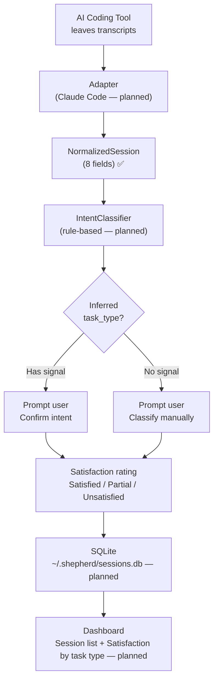

# Shepherd

Real-world AI usability measurement. Rate your AI coding sessions, see which approaches work, and learn which tasks you can delegate.

## Why

AI benchmarks measure what models *can* do in isolation. They don't measure what models *actually do* in real workflows with real configs and real users judging the outcomes. Shepherd captures that missing signal: intent, approach, and satisfaction — not tokens, latency, or cost.

## Install

```bash
uv tool install shepherd
```

## Usage

> **Note:** CLI commands are the target interface. Not yet implemented — see project structure below.

```bash
# Rate your most recent unrated session
shepherd rate

# Catch up — rate all unrated sessions
shepherd rate --all

# See unrated sessions
shepherd list

# Open personal dashboard
shepherd dashboard
```

After a session, `shepherd rate` asks two questions:

1. **What were you working on?** — Shepherd infers from session signals (skills used, MCPs, tool patterns). Confirm or correct.
2. **How did it go?** — Satisfied / Partial / Unsatisfied.

That's it. Under 5 seconds.

## How it works

> **Note:** This describes the target architecture. Implemented modules are marked below.

Shepherd reads session transcripts left by your AI coding tool and normalizes them into a common format. It infers your intent from skills, MCP servers, and tool patterns — then asks you to confirm.



## Agent-agnostic

Shepherd doesn't hook into any AI tool. It reads transcripts after the session ends. Each AI tool has an adapter that normalizes its format:

| Adapter | Status | Transcript format |
|---------|--------|-------------------|
| Claude Code | Planned | JSONL from `~/.claude/projects/` |
| Cursor | Planned | SQLite |
| Aider | Planned | Markdown |
| Copilot | Planned | VS Code logs |

Missing fields are null, not errors. A session from a tool without skills just has `skills_used: []`.

## What gets stored

**8 fields per session:**

| Field | Purpose |
|-------|---------|
| `session_id` | Uniquely identifies the session |
| `timestamp_start` | When it started |
| `end_type` | How it ended (confirmed, closed, timed_out, clear) |
| `task_type` | What you were doing (feature, bugfix, refactor, exploration, review, docs) |
| `intent_confirmed` | Whether inference was correct |
| `satisfaction` | Outcome (satisfied, partial, unsatisfied) |
| `skills_used` | Skills invoked during the session |
| `mcps_used` | MCP servers used (e.g., webclaw, agent-browser) |

Everything else stays in the original transcript on your machine. Fields are added to the schema when the dashboard proves a need for them — not before.

## Privacy

Two tiers:

- **Local-only**: Raw CLAUDE.md section headings, individual skill names, full references. Never leaves your machine.
- **Shareable** (future hub): Derived abstractions only — section counts, boolean flags, category tags. Nothing that could identify you or your codebase.

## Dashboard v0.1

Two views:

- **Session list** — task type, skills, MCPs, satisfaction for each session
- **Satisfaction by task type** — which kinds of tasks AI handles well

More views (trend over time, model breakdown, skill frequency) added based on what users actually ask for.

## Intent inference

V1 uses rule-based classification:

- Skill name → task type (e.g., `tdd` → feature, `review` → review)
- Tool pattern → task type (e.g., heavy Edit+Write+Bash → feature)
- **No signal → ask the user.** Never default to "exploration" or guess.

When inference is wrong, correct it. That signal improves future accuracy.

## Development

```bash
# Install for development
uv sync

# Run tests
uv run pytest

# Run with local changes
uv run shepherd rate
```

## Project structure

```
shepherd/
├── adapters/          # Per-agent transcript parsers (planned)
│   └── claude_code.py # Claude Code JSONL adapter (planned)
├── classifier.py      # IntentClassifier (rule-based) — planned
├── models.py          # NormalizedSession dataclass ✅
├── pipeline.py        # Pipeline orchestrator (scaffolded)
├── storage.py         # SQLite CRUD — planned
├── discovery.py       # Session discovery (find unrated transcripts) — planned
├── cli.py             # CLI commands (rate, list, dashboard) — planned
└── dashboard.py       # Local web UI — planned
```

## License

MIT